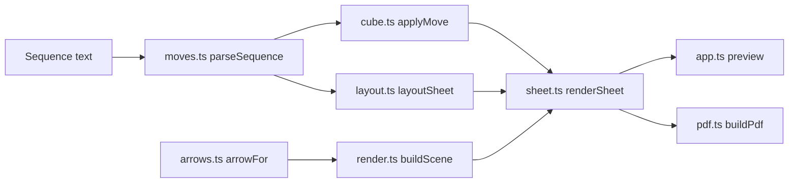

> Generated by /vibe:docs — manual edits will be overwritten; use README for hand-written content.

# Architecture

The page turns a text move sequence into SVG pages, shows them as a preview, and converts the same SVG pages to a vector PDF. Preview and PDF share one drawing, so they cannot drift apart.

## Modules

| Module | Responsibility |
|---|---|
| `src/moves.ts` | Strict parser: faces `U D L R F B`, suffix `'` or `2`. Returns the first error with its 1-based position. |
| `src/cube.ts` | 54-sticker cube state (faces in the order U, R, F, D, L, B). Each face turn is a sticker permutation computed once from 3D positions. Start orientation: yellow top, green front, orange right. |
| `src/arrows.ts` | Where the arrow of each move goes. U, D, L, R use the front face, F and B use the right face. Hidden-face moves are drawn on the visible edge of their layer. |
| `src/render.ts` | Isometric projection and drawing of one cube (27 visible stickers, arrow with gradient, `x2` marker). Works in cubie-edge units, so scale is applied by the caller. |
| `src/layout.ts` | A4 page at 300 dpi (2481 x 3508), 120 px margins, 3 columns, at most 30 steps per page. Cube and label sizes adapt to the row count. |
| `src/sheet.ts` | Combines state, layout and drawing into one SVG document per page. Each step shows the cube before its move. |
| `src/pdf.ts` | Draws each SVG page on an A4 page with jsPDF and svg2pdf.js (vector, text kept as text). |
| `src/app.ts` | The page: field, validation messages, live preview, download button and its states. Dependencies are injected so tests can replace the PDF and save steps. |
| `src/messages.ts` | Wording of the parse errors. |
| `src/main.ts` | Browser entry point: mounts the app and saves the PDF through a temporary link. |

## Sizing rules

- Up to 15 steps keep the size of the reference sheet (5 rows), so a short sequence does not get giant cubes.
- From 16 to 30 steps the rows grow (up to 10) and the cubes shrink to fit.
- Labels never go under 34 px (8 pt printed).
- From 31 steps, a new page starts after every 30 steps, with the same cube size on every page.

## Deployment

`.github/workflows/deploy.yml` runs lint, tests and build on every push to `main`, then publishes `dist/` to GitHub Pages. The Vite `base` is `./`, so the site works under a repository sub-path.
